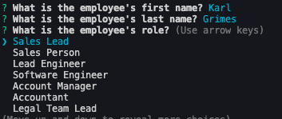

# MySQL Homework: Employee Tracker

[Link to GitHub Repo](https://github.com/jenniferdaeumler/gt-sql-employee-tracker-homework-12)

## Description

This application allows users to utilize a SQL database via the server. Users can view all employees, view employees by department and by manager. Users can also add new employees via prompts, and data will be added to the mySQL database. Users can also update and delete employees via prompts, and the data will be stored in mySQL as well.

## Table of Contents

1. [Installation](#installation)
2. [Usage](#usage)
3. [Credits](#credits)
4. [MIT License](#mit-license)
5. [Contributing](#contributing)

## Installation

Clone the repo, and run in the server. Follow the prompts via node.js.

## Usage

After installing the proper npm packages. Run "node server.js" in the terminal. Select the action desired via arrow keys and hitting enter. Follow the prompts request, and when complete, click exit.

## Credits

Solo projected completed as homework for Georgia Tech Full-Stack Flex Program.
Trilogy Education provided assets.

## MIT-License

Copyright (c) [2020][jennifer daeumler]

Permission is hereby granted, free of charge, to any person obtaining a copy
of this software and associated documentation files (the "Software"), to deal
in the Software without restriction, including without limitation the rights
to use, copy, modify, merge, publish, distribute, sublicense, and/or sell
copies of the Software, and to permit persons to whom the Software is
furnished to do so, subject to the following conditions:

The above copyright notice and this permission notice shall be included in all
copies or substantial portions of the Software.

THE SOFTWARE IS PROVIDED "AS IS", WITHOUT WARRANTY OF ANY KIND, EXPRESS OR
IMPLIED, INCLUDING BUT NOT LIMITED TO THE WARRANTIES OF MERCHANTABILITY,
FITNESS FOR A PARTICULAR PURPOSE AND NONINFRINGEMENT. IN NO EVENT SHALL THE
AUTHORS OR COPYRIGHT HOLDERS BE LIABLE FOR ANY CLAIM, DAMAGES OR OTHER
LIABILITY, WHETHER IN AN ACTION OF CONTRACT, TORT OR OTHERWISE, ARISING FROM,
OUT OF OR IN CONNECTION WITH THE SOFTWARE OR THE USE OR OTHER DEALINGS IN THE
SOFTWARE.

## Contributing

If you created an application or package and would like other developers to contribute it, you will want to add guidelines for how to do so. The [Contributor Covenant](https://www.contributor-covenant.org/) is an industry standard, but you can always write your own.
